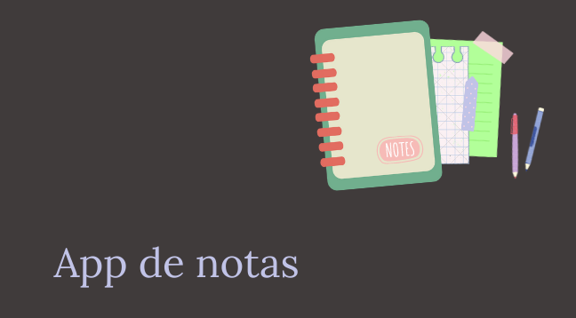

# APP DE NOTAS

App de tareas (Tp 1 y tp2) Vamos a armar una app de tareas que nos permita guardar notas cortas utilizando las
herramientas que hasta el momento hemos aprendido.

## Clase 11

## Ubicación -> Programación/TRABAJOS PRACTICOS/app de notas